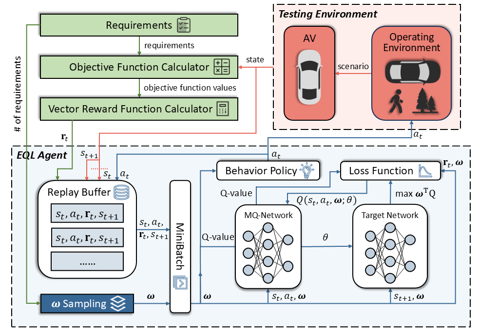

# Multi-Objective Reinforcement Learning for Critical Scenario Generation of Autonomous Vehicles

## Abstract
Autonomous vehicles (AVs) make driving decisions without human intervention. Therefore, ensuring AVs' dependability is critical. Despite significant research and development in AV development, their dependability assurance remains a significant challenge due to the complexity and unpredictability of their operating environments. Scenario-based testing evaluates AVs under various driving and environmental scenarios, but the unlimited number of potential scenarios highlights the importance of identifying critical scenarios that can violate safety or functional requirements. Such requirements are inherently interdependent and need to be tested simultaneously. To this end, we propose MOEQT, a novel multi-objective reinforcement learning (MORL)-based approach to generate critical scenarios that simultaneously test interdependent safety and functional requirements. MOEQT adapts Envelope Q-learning as the MORL algorithm, which dynamically adapts multi-objective weights to balance the relative importance between multiple objectives. MOEQT generates critical scenarios to violate multiple requirements through dynamically interacting with the AV environment, ensuring comprehensive AV testing. We evaluate MOEQT using an advanced end-to-end AV controller (i.e., Interfuser) and a high-fidelity simulator (i.e., CARLA). MOEQT is evaluated on six driving roads and compared with two baselines: a random strategy and a single-objective RL with a weighted reward function. Our evaluation results show that MOEQT achieved an overall better performance in identifying critical scenarios for violating multiple requirements than the baselines.



## Setup
Operating System: Linux

Python Version: 3.7

```
# build the environment
pip install -r requirements.txt
cd interfuser
python setup.py develop

# download and setup CARLA 0.9.10.1
chmod +x setup_carla.sh
./setup_carla.sh
easy_install carla/PythonAPI/carla/dist/carla-0.9.10-py3.7-linux-x86_64.egg
```

## How to run
### Training
```
cd RL/MORL_baselines

# for MOEQT
python strategy_rl_morl.py --port=2000 --trafficManagerPort=8000 \
--evaluations=1200 --algorithm=envelope --objective=time_to_collision+completion \
--optuna=False --eval=False --lr=0.0001 --batch_size=16 --learning_starts=512 \
--max_grad_norm=1.0 --num_sample_w=16 --decay_steps=4000 --memory=2000 --drop_rate=0.0 \
--scenario_id=scenario_4 --routes=/MOEQT/leaderboard/data/test_routes/scenario_4.xml \
--scenarios=/MOEQT/leaderboard/data/test_routes/scenario_4.json

# for single-objective RL
python strategy_rl_morl.py --port=2000 --trafficManagerPort=8000 \
--evaluations=1200 --algorithm=single --objective=time_to_collision+completion \
--optuna=False --eval=False --lr=0.001 --batch_size=16 --learning_starts=512 \
--decay_steps=1000 --memory=1000 --drop_rate=0.0 --scenario_id=scenario_1 \
--routes=/MOEQT/leaderboard/data/test_routes/scenario_1.xml \
--scenarios=/MOEQT/leaderboard/data/test_routes/scenario_1.json
```

### Evaluation
```
cd RL/MORL_baselines

# for MOEQT
python strategy_rl_morl.py --port=2000 --trafficManagerPort=8000 \
--evaluations=100 --algorithm=envelope --objective=time_to_collision+completion \
--optuna=False --eval=True --lr=0.0001 --batch_size=16 --learning_starts=512 \
--max_grad_norm=1.0 --num_sample_w=16 --decay_steps=None --memory=2000 --drop_rate=0.0 \
--scenario_id=scenario_2 --routes=/MOEQT/leaderboard/data/test_routes/scenario_2.xml \
--scenarios=/MOEQT/leaderboard/data/test_routes/scenario_2.json

# for single-objective RL
python strategy_rl_morl.py --port=2000 --trafficManagerPort=8000 \
--evaluations=100 --algorithm=single --objective=time_to_collision+completion \
--optuna=False --eval=True --lr=0.001 --batch_size=16 --learning_starts=512 \
--decay_steps=None --memory=1000 --drop_rate=0.0 --scenario_id=scenario_5 \
--routes=/MOEQT/leaderboard/data/test_routes/scenario_5.xml \
--scenarios=/MOEQT/leaderboard/data/test_routes/scenario_5.json

# for random
python strategy_rl_morl.py --port=2000 --trafficManagerPort=8000 \
--evaluations=100 --algorithm=random --optuna=False --eval=True \
--scenario_id=scenario_3 --routes=/MOEQT/leaderboard/data/test_routes/scenario_3.xml \
--scenarios=/MOEQT/leaderboard/data/test_routes/scenario_3.json
```

### Analysis
```
cd RL/MORL_baselines
python evaluation.py
```

## Model, Data, and Results
**_RL/MORL_baselines/train_results_** contains trained models, training process data, and partial results.

**_RL/MORL_baselines/eval_results_** contains evaluation process data and partial results.
